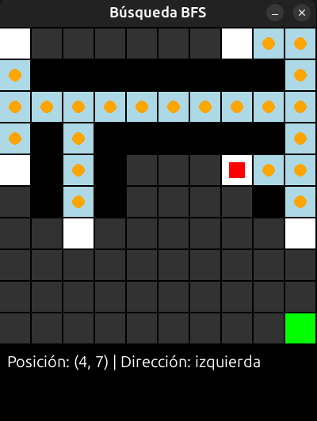

# 🤖 Visualizador de Algoritmos de Búsqueda (BFS y DFS)

[](https://www.python.org/)
[](https://pypi.org/)

Este proyecto es un visualizador interactivo diseñado para demostrar y comparar el funcionamiento de los algoritmos de búsqueda **BFS (Búsqueda en Anchura)** y **DFS (Búsqueda en Profundidad)** en un laberinto.

El programa hace dos cosas:
1.  **Simulación en Vivo:** Muestra un agente explorando un laberinto en tiempo real usando Pygame, con una "niebla de guerra" que se descubre.
2.  **Generación de Árbol de Búsqueda:** Al finalizar la búsqueda, utiliza `networkx` y `matplotlib` para generar y mostrar el **árbol de búsqueda** completo, mostrando cada estado visitado y la acción que llevó a él.

## 🖼️ Demostración

El programa tiene dos salidas visuales principales:

**1. La Simulación en Pygame (en vivo):**



**2. El Árbol de Búsqueda Generado (al final):**
*(Esta es la imagen que proporcionaste, `arbol_busqueda.png`)*


## ✨ Características Principales

* **Algoritmos BFS y DFS:** Implementación de los dos algoritmos de búsqueda no informada más fundamentales.
* **Prioridad de Expansión Personalizable:** El usuario **debe** definir un orden de prioridad (ej. "ADBI" para Arriba, Derecha, Abajo, Izquierda). Esto permite ver cómo la cola (BFS) y la pila (DFS) se comportan de manera diferente según el orden de los operadores.
* **Generación de Árbol de Estados:** Construye un grafo dirigido (`DiGraph`) con `networkx` en tiempo real, añadiendo un nodo por cada estado (`(fila, col, direccion)`) y una arista por cada acción (`avanzar`).
* **Visualización de Grafos:** Utiliza `matplotlib` y `pygraphviz` (a través de `networkx`) para dibujar un diseño jerárquico (`dot`) del árbol de búsqueda, facilitando su análisis académico.
* **Entorno Parcialmente Observable:** El agente opera con una "niebla de guerra" (`mapa_visible`) y debe "sensar" su entorno, revelando el mapa a medida que avanza.
* [cite_start]**Carga de Mapas:** Carga el laberinto desde un archivo `map.txt`[cite: 2].

## ⚙️ Dependencias

Para ejecutar este proyecto, necesitas las siguientes bibliotecas de Python:

* `pygame`: Para el motor de juego y la visualización en vivo.
* [cite_start]`numpy`: Para cargar y manejar la matriz del laberinto[cite: 2].
* `networkx`: Para crear y gestionar la estructura de datos del grafo.
* `matplotlib`: Para dibujar el grafo final.
* `pygraphviz` (o `pydot`): Necesario para que `networkx` pueda crear el diseño jerárquico (`graphviz_layout(prog='dot')`).

Puedes instalarlas usando `pip`:

```bash
pip install pygame numpy networkx matplotlib pygraphviz
```

## 🚀 Cómo Ejecutar

1.  Asegúrate de tener todas las dependencias instaladas.
2.  [cite_start]Coloca el archivo `map.txt` [cite: 2] en la misma carpeta que el script.
3.  Ejecuta el script de Python:
    ```bash
    python tu_script.py
    ```
    *(Reemplaza `tu_script.py` con el nombre de tu archivo)*

4.  **Sigue las instrucciones en la CONSOLA:**
    * **Coords. de Inicio:** Introduce la fila y columna (ej. `8`, `1`).
    * **Coords. de Objetivo:** Introduce la fila y columna (ej. `1`, `8`).
    * **Algoritmo:** Escribe `BFS` o `DFS`.
    * **Orden de Prioridad:** Escribe la prioridad (ej. `ADBI` o `IABD`).

5.  **Observa:**
    * Se abrirá una ventana de **Pygame** mostrando la simulación en vivo.
    * Cuando termine, se cerrará y se abrirá una ventana de **Matplotlib** con el árbol de búsqueda completo.
